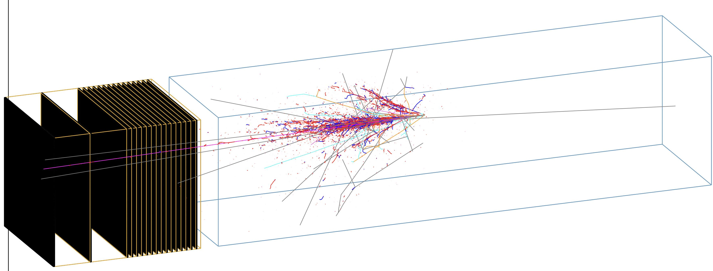

# FLArE

Simulation code for R&D of the FLArE detector


## Setting up on lxplus

The `LXPLUS` service at CERN (`lxplus.cern.ch`) provides a cluster of machines for interactive computing as well as access to the HTCondor batch system for job submission. Provided you have a valid CERN computing account, you can access LXPLUS following these instructions:

1. Visit the list of services at the [CERN Resources Portal](https://resources.web.cern.ch/resources/Manage/ListServices.aspx), and search for boxes: LXPLUS and Linux, AFS Workspaces, EOS/CERNBox.
2. Subscribe to LXPLUS and Linux.
3. Subscribe and setup your AFS Workspaces: you can have up to 10GB in `/afs/cern.ch/user/<initial>/<username>` and up to 100GB in `/afs/cern.ch/work/<initial>/<username>`. You can set these limits from the Settings in the "AFS Workspace". 
4. Subscribe to EOS/CERNBox and login to cernbox: [https://cernbox.cern.ch/](https://cernbox.cern.ch/). This will allow you access to `/eos/user/<initial>/<username>` with up to 1TB of space.

Users are recommended to setup code in their AFS Workspace areas and use their EOS/CERNBox for long term data storage.
A simple script is provided to setup the relevant software dependencies in the LXPLUS environment.

```bash
source lxplus_setup.sh
```

## Setting up on local machine with Docker

An el9 Docker container which mimics the lxplus environment is available from [DockerHub](https://hub.docker.com/layers/benw22022/faser/el9-cvmfs/images/sha256-e6cffa8f752e192eae60b134dd28fb34682d257e02eed9355d17986c186ae116?context=repo).

A repository containing a script to easily run the container and mount `cvmfs` is available from [github.com/benw22022/el9-cvmfs-docker](https://github.com/benw22022/el9-cvmfs-docker?tab=readme-ov-file)

To get started do:

```bash
git clone https://github.com/benw22022/el9-cvmfs-docker.git
cd el9-cvmfs-docker/
./run_container /path/to/FLArE
```

This will automatically pull and start the container and copy the `.bashrc` file which mounts `cvmfs` when the container starts.

As mentioned, this software relies upon the `HEP_HPC` library. A precompiled version of this code which is compatible with the container is provided in the repository. To set this up run

```bash
# You only need to do this once
cd FLArE
tar -xvf HEP_HPC-el9.tar 
```

Then to set up the environment do

```bash
source FLArE/local_setup.sh
```

## To compile the code

* Create a new directory to contain the executables (assume the path is `/path/to/build`).
* Assume the path to the source code is `/path/to/source`.
* To compile, you need to go to the build directory `cd /path/to/build`.
* And then `cmake -S /path/to/source -B /path/to/build`.
* Finally, `make` or `make install`.

The minimal software requirements are:

* Geant4 v4_10_6_p01c
* ROOT v6_22_06a
* HEP_HPC v0_14_01
* HDF5 v1_10_0+

These are automatically satisfied once the `lxplus_setup.sh` script is sourced.
There is no longer an explicit GENIE dependency. However, the input GENIE `ghep` files need to be converted in the `gst` format (plain ROOT tree). The conversion can be perfomed with the native GENIE utility `gntpc`.

## Run the simulation

Once the code has been compiled, the simulation can be run by passing a macro file to the `FLArE` executable:

```bash
./FLArE /path/to/macro.mac
```

Several examples of macros are available in the `macros` directory.
The detector geometries can be easily imported by including one of the macros in `macros\geometry_options`.
If no macro is passed as argument, the default is `macros\vis.mac` which simply displays the current geometry.

### Single particles

There are several `.mac` macros in `macros\single_particle` directory: `LAr_e-_mono.mac`, `LAr_mu-_mono.mac`, etc.
As denoted by the name, they're used to simulate single e-/mu-/... particles inside the FLArE volume.
To run a simulation, just do `./FLArE macros/single_particle/LAr_e-_mono.mac`.
If you want to modify the energy you intend to simulate, modify the parameters inside the mac scripts.

### Neutrino events

Neutrino events are generated by reading nu-Ar interaction vertexes from GENIE output files and transposing the final states particles in Geant4.
These GENIE `gst` files are available for all users in `\eos\user\m\mvicenzi\genie`.
Example macros can be found in `macros`: `numu_genie.mac`, `nue_genie.mac`, `nutau_genie.mac`.

### Background events

Background particles entering the FPF (muons, neutrons) are generated using the fluxes produced by the CERN-FLUKA team simulations.
Events are sampled via summary histograms available in `backgrounds\background_input.root`.
An example macro can be found in `macros`: `backgrounds.mac`.

## Macro commands

### Geometry

|Command |Description | Default |
|:--|:--|:--|
|/det/saveGdml          | option for saving detector geometry in a GDML file, run before `/run/initialize`     |`false`|
|/det/fileGdml          | option for specifying the GDML file name, run before `/run/initialize`               |`FPF_FLArE_geo.gdml`|
|/det/checkOverlap      | check overlap of volumes during detector construction, run before `/run/initialize`  |`false`|
|/det/addFLArE          | option for adding the FLArE detector, run before `/run/initialize`                   |`true`|
|/det/addFORMOSA        | option for adding the FORMOSA detector, run before `/run/initialize`                 |`true`|
|/det/addFASERnu2       | option for adding the FASERnu2 detector, run before `/run/initialize`                |`true`|
|/det/faser/addFASER2   | option for adding the FASER2 detector, run before `/run/initialize`                  |`true`|
|/det/flare/addFLArEPos | position of the FLArE detector, run before `/run/initialize`                         |`0 0 4300 mm`|
|/det/flare/material    | option for detector material, choose `LAr` or `LKr`, run before `/run/initialize`    |`LAr`|
|/det/flare/module      | option for tpc module option, choose `single` or `3x7`, run before `/run/initialize` |`single`|
|/det/flare/field       | option for setting the magnetic field value in FLArE HadCather and Muon Finder       |`1 T`|
|/det/flare/useBabyMIND | option for using BabyMIND instead of the legacy FLArE HadCather and Muon Finder      |`false`|
|/det/babymind/blockSequence | option for BabyMIND module sequence |`\|MMMMD\|\|DMMMD\|\|DMMMMD\|\|MMDMMD\|\|MMDMMD\|\|MDMDMD\|\|DMMMD\|`|
|/det/babymind/magnetPlateThickness  | option for BabyMIND magnet plate thickness                              |`30 mm`|
|/det/babymind/magnetPlateSizeX      | option for BabyMIND magnet plate size x                                 |`3 m`|
|/det/babymind/magnetPlateSizeY      | option for BabyMIND magnet plate size y                                 |`2 m`|
|/det/babymind/magnetCentralPlateY   | option for BabyMIND central magnet plate height (y)                     |`1 m`|
|/det/babymind/slitSizeX             | option for BabyMIND magnet plate slit size x                            |`2.8 m`|
|/det/babymind/slitSizeY             | option for BabyMIND magnet plate slit size y                            |`10 mm`|
|/det/babymind/fieldStrength         | option for BabyMIND magnetic field strength                             |`1.5 T`|
|/det/babymind/verticalNbars         | option for number of vertical bars in BabyMIND modules                  |`16`|
|/det/babymind/horizontalNbars       | option for number of horizontal bars in babyMIND modules                |`96`|
|/det/babymind/barThickness          | option for BabyMIND scintillator bar thickness                          |`7.5 mm`|
|/det/babymind/verticalBarSizeX      | option for BabyMIND vertical scintillator bar size x                    |`21 cm`|
|/det/babymind/verticalBarSizeY      | option for BabyMIND vertical scintillator bar size y                    |`2 m`|
|/det/babymind/horizontalBarSizeX    | option for BabyMIND horizontal scintillator bar size x                  |`3 m`|
|/det/babymind/horizontalBarSizeY    | option for BabyMIND horizontal scintillator bar size y                  |`3 cm`|
|/det/babymind/magnetToScinSpacing   | option for BabyMIND magnet plate to scintillator module spacing         |`15 mm`|
|/det/babymind/magnetToMagnetSpacing | option for BabyMIND magnet plate to magnet plate spacing                |`20 mm`|
|/det/babymind/blockToBlockSpacing   | option for BabyMIND block to block spacing                              |`30 mm`|
|/det/babymind/blockPadding          | option for BabyMIND block padding size                                  |`100 mm`|
|/det/formosa/addFORMOSAPos   | position of the FORMOSA detector, run before `/run/initialize`                       |`0 0 13870 mm`|
|/det/fasernu/addFASERnu2Pos  | position of the FASERnu2 detector, run before `/run/initialize`                      |`0 0 22023 mm`|
|/det/faser/addFASER2Pos      | position of the FASER2 detector, run before `/run/initialize`                        |`0 0 42636 mm`|
|/det/faser/magnetGeom        | option for FASER2 magnet geometry, choose `SAMURAI` or `CrystalPulling`              |`SAMURAI`|
|/det/faser/magnetField       | option for setting the FASER2 magnetic field value                                   |`1 T`|
|/det/faser/magnetWinX        | option for SAMURAI magnet window size along X axis                                   |`3.0 m`|
|/det/faser/magnetWinY        | option for SAMURAI magnet window size along Y axis                                   |`1.0 m`|
|/det/faser/magnetWinZ        | option for SAMURAI magnet window size along Z size                                   |`4.0 m`|
|/det/faser/yokeThickX        | option for SAMURAI yoke thickness along X axis                                       |`1.5 m`|
|/det/faser/yokeThickY        | option for SAMURAI yoke thickness along Y axis                                       |`2.0 m`|
|/det/faser/magnetNumber      | option for number of CrystalPulling magnets                                          |`3`|
|/det/faser/magnetInnerR      | option for CrystalPulling magnet inner radius                                        |`0.8 m`|
|/det/faser/magnetOuterR      | option for CrystalPulling magnet outer radius                                        |`1.2 m`|
|/det/faser/magnetLengthZ     | option for CrystalPulling magnet size along Z axis                                   |`1.25 m`|
|/det/faser/magnetGap         | option for gap length (along Z) between CrystalPullin magnets                        |`0.5 m`|
|/det/faser/trackingNumber    | option for number of FASER2 tracking stations in each assembly                       |`6`|
|/det/faser/trackingNBarsX    | option for number of vertical scintillator bars (segmentation along X axis)          |`7`|  
|/det/faser/trackingNBarsY    | option for number of horizontal scintillator bars (segmentation along Y axis)        |`3`|
|/det/faser/trackingScinThick | option for scintillator bar thickness (along Z) in tracking layers                   |`1.0 cm`|
|/det/faser/trackingGap       | option for gap length (along Z) between tracking stations, and gap to magnet         |` 0.5 m`|

### Event generators

|Command |Description |
|:--|:--|
|/genie/useGenie      | option for PrimaryGeneratorMessanger, set `true` to read neutrino interactions from GENIE|
|/genie/genieInput    | if `useGenie is true`, give which `.gst.root` file to read GENIE events|
|/genie/genieIStart   | if `useGenie is true`, give the start position of the file to read GENIE events|
|/bkg/useBackground   | option for PrimaryGeneratorMessanger, set `true` to use FPF background spills|
|/bkg/backgroundInput | if `useBackground is true`, give which file to sample background events|
|/bkg/backgroundWindow| if `useBackground is true`, set time window for background extraction|

### Analysis

|Command |Description |
|:--|:--|
|/histo/fileName     | option for AnalysisManagerMessenger, set name of the file saving all analysis variables|
|/histo/saveHit      | if `true` save info for all hits, `false` in default to save space|
|/histo/saveTrack    | if `true` save info for all tracks, `false` in default, requires `\tracking\storeTrajectory 1`|
|/histo/save3DEvd    | if `true` save 3D spatial distribution of energy deposition, `false` in default|
|/histo/save2DEvd    | if `true` save 2D spatial distribution of energy deposition, `false` in default|
|/histo/circleFit    | if `true` run circle fitting and save information in output, `false` in default to save space|
|/histo/addDiffusion | if `toy` diffuse energy, if `single` diffuse single electron, `false` in default without diffusion|

## How to save an event display with high resolution using the DAWN Event Display

There is [this tutorial](https://conferences.fnal.gov/g4tutorial/g4cd/Documentation/Visualization/G4DAWNTutorial/G4DAWNTutorial.html) for use at the October 2003 Fermilab Geant4 Tutorial.

* Add `/vis/open DAWNFILE` to the mac file, after running a pass of simulation you'll find a ".prim" files suitable for viewing in DAWN.
* Run `~/dune_data/app/dawn_3_91a/dawn -d filename.prim`, and it will generate a high resolution picture with the format of EPS.

## Some initial results

[cern indico 1](https://indico.cern.ch/event/1095064/contributions/4621162/attachments/2349156/4006611/20211118%40FLArEDetectorSimulation.pdf) 
[cern indico 2](https://indico.cern.ch/event/1250086/#3-status-update-on-flare-simul)
